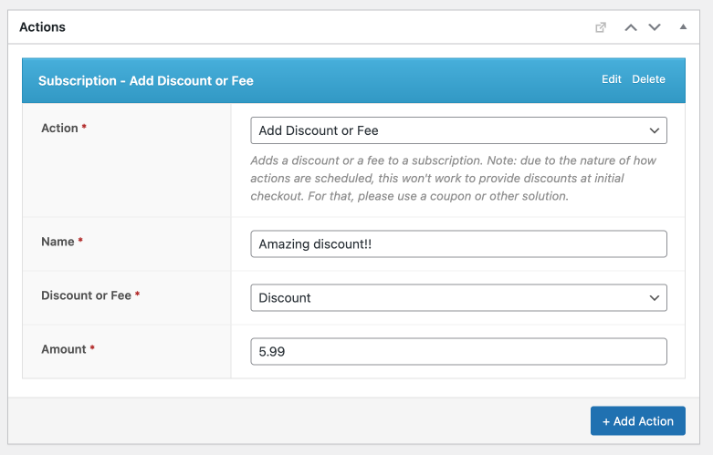
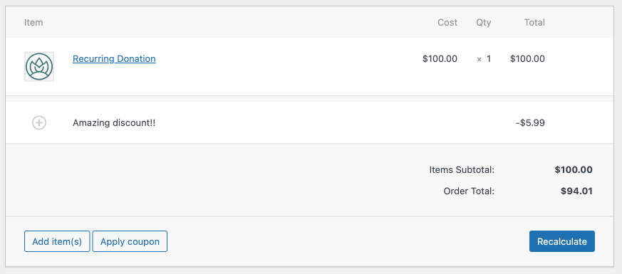

# AutomateWoo Subscription Action - Add Discount or Fee

Extends the functionality of AutomateWoo with a custom action which allows you to add a discount or a fee as a line item.

## Usage
- Name: this is the name of the discount or fee, which shows on the line item in the subscription.
- Discount or Fee: A discount will show up as a negative number and subtract from the subscription total. A fee is a positive number and will add to the total.
- Amount: Input a positive number which will show up as a discount or fee. e.g. `10.00`

Any fee added will not be treated as a taxable item. If you need that functionality, let me know and we can add it as an option.

**Note:** due to the nature of how actions are scheduled, this won't work to provide discounts at initial checkout. For that, please use a coupon or other solution.

## Support

This plugin is provided without any support or guarantees of functionality. If you'd like to contribute, feel free to open a PR on this repo. Please test thoroughly before deploying to a production site.
